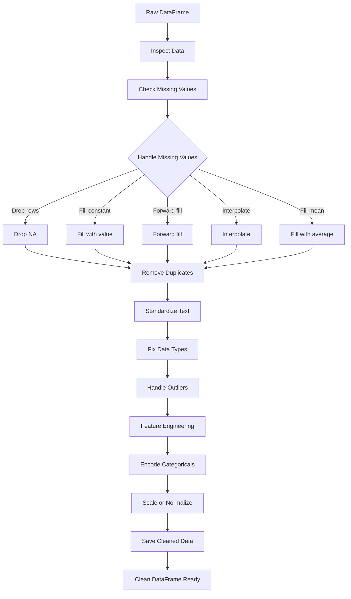

# Python Data Cleaning Process
Added a flowchart and step-by-step guide for the Python data cleaning process using Pandas.

| Step | Python Pandas Code |
|------|---------------------|
| **1. Inspect Data** | `df.info()` `df.head()` `df.describe()` |
| **2. Check Missing Values** | `df.isnull().sum()` |
| **3. Drop rows with NA** | `df.dropna()` |
| **4. Fill with constant** | `df.fillna('Unknown')` |
| **5. Forward fill** | `df.fillna(method='ffill')` |
| **6. Interpolate** | `df.interpolate()` |
| **7. Fill with mean/median** | `df.fillna(df['col'].mean())` |
| **8. Remove Duplicates** | `df.drop_duplicates()` |
| **9. Standardize Text** | `df['col'] = df['col'].str.strip().str.upper()` |
| **10. Fix Data Types** | `df['date'] = pd.to_datetime(df['date'])` `df['value'] = pd.to_numeric(df['value'])` |
| **11. Handle Outliers (IQR)** | `Q1 = df['col'].quantile(0.25)` `Q3 = df['col'].quantile(0.75)` `IQR = Q3 - Q1` `df = df[(df['col'] >= Q1 - 1.5*IQR) & (df['col'] <= Q3 + 1.5*IQR)]` |
| **12. Feature Engineering** | `df['age_group'] = pd.cut(df['age'], bins=[0,18,60,100], labels=['child','adult','senior'])` |
| **13. Encode Categoricals** | `df = pd.get_dummies(df, columns=['category'])` |
| **14. Scale or Normalize** | `from sklearn.preprocessing import StandardScaler` `scaler = StandardScaler()` `df[['col']] = scaler.fit_transform(df[['col']])` |
| **15. Save Cleaned Data** | `df.to_csv('cleaned_data.csv', index=False)` |
